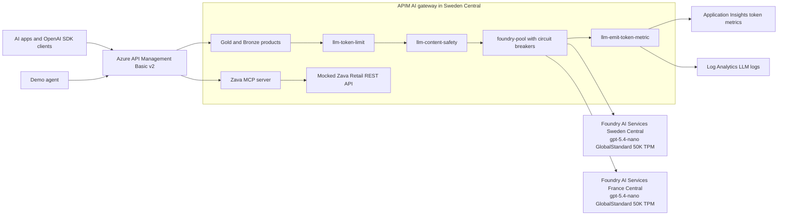

# Azure API Management AI Gateway demo

This repository is a complete Azure API Management AI Gateway demo for Zava Retail: Bicep deploys API Management Basic v2, two Microsoft Foundry AI Services model backends, token budgets, content safety, MCP tooling, and observability; the Python demo client proves keyless chat, load balancing, throttling, safety enforcement, MCP tools, an agent flow, and token telemetry.

## What's inside

| Material | Path | Purpose |
| --- | --- | --- |
| Native session deck | [docs/presentations/apim-ai-gateway-session.pptx](docs/presentations/apim-ai-gateway-session.pptx) | Editable PowerPoint deck for delivery. |
| Marp deck source | [docs/presentations/apim-ai-gateway.md](docs/presentations/apim-ai-gateway.md) | Markdown source for the standards-compliant deck. |
| Convenience PDF | [docs/presentations/apim-ai-gateway.pdf](docs/presentations/apim-ai-gateway.pdf) | Exported deck for sharing. |
| Presentation build notes | [docs/presentations/README.md](docs/presentations/README.md) | Deck build and export commands. |
| Pitch materials | [docs/narrative/pitch.md](docs/narrative/pitch.md) | Elevator pitch, one-pager, and persona value props. |
| Session narrative | [docs/narrative/session-narrative.md](docs/narrative/session-narrative.md) | 90-minute run-of-show and talk track. |
| Demo script | [docs/narrative/demo-script.md](docs/narrative/demo-script.md) | Presenter preflight, scenario commands, and recovery notes. |
| FAQ | [docs/narrative/faq.md](docs/narrative/faq.md) | APIM AI Gateway Q&A and KQL snippets. |
| Demo video | [docs/video/apim-ai-gateway-demo.mp4](docs/video/apim-ai-gateway-demo.mp4) | English narrated walkthrough video. |
| Video notes | [docs/video/README.md](docs/video/README.md) | Video build and narration notes. |
| Research brief | [docs/research/apim-ai-gateway-research.md](docs/research/apim-ai-gateway-research.md) | APIM AI Gateway feature research and source index. |
| Infrastructure | [infra/](infra/) | Subscription-scope Bicep, APIM policies, and OpenAPI specs. |
| Demo client | [demo/](demo/) | Python package and tests for live scenarios. |
| ADRs | [docs/adr/](docs/adr/) | Architecture decisions behind the demo. |

## Architecture



## Prerequisites

- Azure subscription with `Owner`, or `Contributor` plus `Role Based Access Control Administrator`, at subscription scope.
- Azure CLI 2.60 or later with Bicep installed: `az version` and `az bicep version`.
- Python 3.12 or later.
- Model quota for `gpt-5.4-nano` GlobalStandard in both `swedencentral` and `francecentral`, with 50K TPM per region.
- GitHub repository access that can configure Actions secrets, repository variables, and the `azure-demo` environment.
- Python package restore through the Microsoft-protected feed configured on the workstation: `https://packagefeedproxy.microsoft.io/pypi/simple`.

## Quick start

### Option 1: deploy with GitHub Actions

1. Configure Azure authentication:
   - Preferred OIDC: set repository variables `AZURE_CLIENT_ID`, `AZURE_TENANT_ID`, and `AZURE_SUBSCRIPTION_ID` after creating a federated credential.
   - Fallback service principal secret: set the `AZURE_CREDENTIALS` repository secret.
2. Open **Actions** > **Deploy AI Gateway demo**.
3. Run the workflow against `swedencentral` and keep **Run every demo scenario** enabled.
4. Read the workflow summary for `apimGatewayUrl`, `inferenceBaseUrl`, and `mcpEndpoint`.

### Option 2: deploy locally

```powershell
az login
az account set --subscription '<subscription-id-or-name>'
az bicep install
az deployment sub what-if -n apimaigw-demo -l swedencentral -f infra\main.bicep --result-format ResourceIdOnly
az deployment sub create -n apimaigw-demo -l swedencentral -f infra\main.bicep
```

The default deployment creates `rg-apimaigw-demo-swc`.

## Run the demo

```powershell
cd demo
py -3.12 -m venv .venv
.\.venv\Scripts\Activate.ps1
python -m pip install -r requirements.txt
python -m ai_gateway all
```

The client auto-resolves APIM URL, Gold and Bronze subscription keys, and Log Analytics workspace ID through Azure CLI from `rg-apimaigw-demo-swc`.
Use environment variables when you want to override discovery:

```powershell
$env:AZURE_RESOURCE_GROUP = 'rg-apimaigw-demo-swc'
$env:APIM_GATEWAY_URL = 'https://<apim-name>.azure-api.net'
$env:APIM_GOLD_KEY = '<gold-subscription-key>'
$env:APIM_BRONZE_KEY = '<bronze-subscription-key>'
$env:LOG_ANALYTICS_WORKSPACE_ID = '<workspace-customer-id>'
$env:AI_GATEWAY_MODEL = 'gpt-5.4-nano'
```

Expected live results:

| Scenario | Command | Expected result |
| --- | --- | --- |
| D1 | `python -m ai_gateway chat` | HTTP 200 chat completion through France Central. |
| D2 | `python -m ai_gateway load-balance` | Six requests alternate across Sweden Central and France Central. |
| D3 | `python -m ai_gateway token-limit` | Bronze gets 429 after about five calls with `Retry-After`; Gold remains HTTP 200. |
| D4 | `python -m ai_gateway content-safety` | Jailbreak prompt is blocked with HTTP 403 and `x-ai-gateway-error: ContentSafetyPolicyViolated`. |
| D5 | `python -m ai_gateway mcp` | MCP `tools/list` and `tools/call` succeed for product search and order status. |
| D6 | `python -m ai_gateway agent` | The agent calls both MCP tools and answers from tool results. |
| D7 | `python -m ai_gateway metrics` | KQL returns token metrics per product and LLM logs after ingestion delay. |

## Quality gates

Run the same checks as CI before opening a pull request:

```powershell
cd demo
python -m pip install -r requirements-dev.txt
python -m ruff check .
python -m ruff format --check .
python -m mypy ai_gateway
python -m pytest -q
cd ..
az bicep build --file infra\main.bicep --stdout > $null
az bicep lint --file infra\main.bicep
```

## Cost

The default APIM Basic v2 unit is approximately USD 150/month list price, plus model token usage and Log Analytics ingestion.
Validate pricing for your subscription, region, and agreement before quoting externally.
Run the destroy workflow when the demo is not in use.

## Clean up

Preferred cleanup is the **Destroy AI Gateway demo** workflow.
Type the resource group name, for example `rg-apimaigw-demo-swc`, when prompted.
The workflow deletes matching `rg-apimaigw-*` resource groups and purges soft-deleted AI Services and APIM v2 instances.

Local cleanup:

```powershell
az group delete --name rg-apimaigw-demo-swc --yes
az apim deletedservice list --query "[?contains(name, 'apimaigw')].{name:name,location:location}" -o table
```

Purge any listed APIM instance if you need to reuse its name.

## Security notes

- APIM uses its system-assigned managed identity to call Foundry; local auth is disabled on the AI Services accounts.
- No Foundry keys or APIM subscription keys are committed to the repository.
- Demo subscription keys are fetched at runtime from APIM or supplied through environment variables.
- Prefer GitHub Actions OIDC with `id-token: write`; use `AZURE_CREDENTIALS` only as a temporary fallback and rotate it regularly.
- LLM prompt and completion logging is enabled for the demo; review data handling requirements before using the pattern with sensitive data.

## 90-minute session agenda

| Time | Segment | Outcome |
| --- | --- | --- |
| 00-05 | Welcome and Zava Retail hook | Establish AI sprawl: 40 AI apps, 3 model providers, one surprise invoice. |
| 05-15 | Why an AI gateway | Six challenges: credentials, cost and 429s, resiliency, safety, observability, MCP and agent sprawl. |
| 15-25 | APIM in 2026 | Refresher plus what's new: v2 tiers, workspaces, MCP servers, A2A, unified model API, Foundry AI gateway. |
| 25-40 | Capabilities deep dive | Five pillars: security, cost and scale, resiliency, observability, MCP and agents. |
| 40-65 | Live demo | D1-D7 plus CI/CD (D8), with portal evidence. |
| 65-75 | Pricing, limits, choosing a tier | Tier comparison, list prices, service limits. |
| 75-82 | Patterns and labs | Reference architecture, adoption path, AI-Gateway labs. |
| 82-90 | Takeaways and Q&A | Call to action and questions. |

## Links

- [Azure-Samples AI-Gateway labs](https://github.com/Azure-Samples/AI-Gateway)
- [APIM Love resources](https://azure.github.io/api-management-resources/)
- [Microsoft Learn: Generative AI gateway capabilities in Azure API Management](https://learn.microsoft.com/en-us/azure/api-management/genai-gateway-capabilities)
- [Engineering standards](https://github.com/frkim/ai-coding-standards)

## License

This repository is licensed under the [MIT License](LICENSE).
