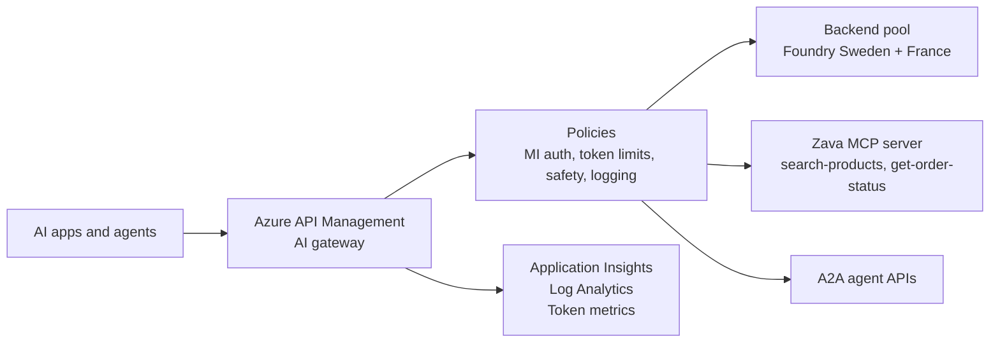

# Azure API Management as your AI Gateway — pitch materials

**Session:** Azure API Management as your AI Gateway — Govern models, MCP tools and agents at scale  
**Audience:** Architects, platform engineers, developers, technical decision makers  
**Date context:** October 2026  
**Pricing note:** Prices are **list price, US East, October 2026**. Verify in the Azure pricing calculator for your subscription, region, and agreement before quoting externally.

## Elevator pitch — 30 seconds

Zava Retail went from one chatbot to 40 AI apps, three model providers, one surprise invoice, a jailbreak incident, and a 429 outage on Black Friday. Azure API Management gives Zava one AI gateway for every model, MCP tool, and agent call. Apps keep using OpenAI-compatible endpoints, while APIM enforces keyless backend access, token budgets, content safety, backend failover, and token-level observability. The result is faster AI adoption with central guardrails instead of duplicated controls in every app.

## Two-minute pitch

Most enterprises are past the single-chatbot phase. Teams are building copilots, agents, batch summarizers, support bots, and MCP-enabled workflows. That creates a new operational problem: every app wants direct access to model endpoints, API keys spread through code and pipelines, token spend becomes hard to attribute, and one team can exhaust a shared quota during a launch or seasonal spike.

Azure API Management is the control point for that world. It sits between AI apps and the model, tool, or agent backend. It can front Microsoft Foundry, OpenAI-compatible endpoints, Anthropic-format APIs on v2 tiers, Google Vertex AI, Amazon Bedrock, Gemini, self-hosted models, REST APIs exposed as MCP servers, existing MCP servers, and A2A agent APIs. The app sees a stable gateway endpoint. The platform team owns policy.

For Zava Retail, APIM solves five concrete failures. Managed identity removes backend keys from apps. `llm-token-limit` gives Gold and Bronze teams different token budgets so the marketing sandbox cannot starve the customer support copilot. Backend pools and circuit breakers spread traffic across Sweden Central and France Central Foundry deployments and honor retry signals on 429 or 5xx responses. `llm-content-safety` blocks jailbreak and harm-category traffic across chat, MCP tool calls, and A2A agent traffic. `llm-emit-token-metric` and LLM logs show token usage by product, backend, and deployment for FinOps and support.

The point is not another model proxy. It is enterprise API governance applied to AI traffic: security, cost control, resiliency, observability, developer self-service, and lifecycle management from the same APIM platform many organizations already use.

## Executive one-pager

### Problem

Enterprises are moving from one AI app to many AI apps and agents. Without a gateway, Zava sees:

- **Credential sprawl:** apps call model providers directly and manage their own keys or tokens.
- **Cost surprise:** token usage is hard to cap or attribute by team.
- **Quota exhaustion:** one app can consume shared TPM and trigger 429s for everyone.
- **Safety gaps:** jailbreak and unsafe content controls are implemented inconsistently.
- **Low visibility:** platform and FinOps teams lack prompt, completion, token, backend, and product-level telemetry.
- **Tool and agent sprawl:** MCP servers and A2A agents appear without central policy, registry, or monitoring.

### Solution

Use Azure API Management as the AI gateway in front of model APIs, MCP servers, REST APIs exposed as MCP tools, and A2A agent APIs.

### Benefits and business outcomes

| Benefit | Business outcome |
|---|---|
| Keyless backend access with managed identity | Reduces key exposure and simplifies credential rotation. |
| Per-product token budgets and quotas | Prevents budget overruns and protects critical workloads during spikes. |
| Backend pools, retry, and circuit breaker | Improves uptime when a deployment returns 429 or 5xx. |
| Content safety for chat, MCP, and A2A | Creates a consistent safety baseline for apps, tools, and agents. |
| Token metrics and LLM logs | Enables chargeback, right-sizing, incident analysis, and adoption reporting. |
| MCP and API Center integration patterns | Makes tools discoverable while preserving central governance. |

### Proof points and demo

The live demo uses Zava Retail with current Foundry resources and projects, not classic hub-based projects or Azure OpenAI resources:

1. Keyless chat through APIM while APIM uses managed identity to Foundry.
2. Load balancing across Sweden Central and France Central model deployments.
3. Gold and Bronze product token budgets, including Bronze 429 behavior.
4. Prompt Shield blocking a jailbreak attempt.
5. REST API exposed as MCP server with `search-products` and `get-order-status` tools.
6. Responses API agent flow where reasoning model turns and MCP tools both go through the gateway.
7. Token metrics and LLM logs in Application Insights and Log Analytics.
8. Bicep and GitHub Actions deployment path.

### Pricing summary

| Tier | Approx. price | Use when |
|---|---:|---|
| Consumption | $0 base, about 1M calls free, then $3.50/M calls | Fast serverless API gateway; not for this demo because MCP and circuit breaker are not supported. |
| Developer | About $48/month | Labs and non-production; no SLA. |
| Basic v2 | About $150/month, 10M calls/unit included, $3.00/M overage | Recommended low-cost AI gateway demo tier with MCP, AI policies, backend pools, and managed identity. |
| Standard v2 | About $700/month, 50M calls/unit included, $2.50/M overage | Adds VNet integration for isolated backends. |
| Premium v2 | About $2,800/unit/month | Highest v2 scale ceiling, VNet injection, availability zones. |

Model tokens are billed separately by Foundry or the model provider. The gateway does not add token cost.

### Next steps

1. Run the Zava demo against the deployed Basic v2 environment.
2. Identify the first three AI apps to put behind an APIM inference API.
3. Define products that map to teams or workload tiers, such as Gold and Bronze.
4. Apply managed identity, token limits, content safety, token metrics, and LLM logging.
5. Add backend pools and circuit breaker for critical production routes.
6. Register MCP servers and agents in the enterprise API catalog when ready.

## Value propositions by persona

| Persona | What they care about | APIM AI gateway value |
|---|---|---|
| CIO / CTO | Scale AI adoption without losing control | One enterprise gateway pattern for models, MCP tools, and agents; works with Foundry and multiple providers. |
| CISO | Secrets, data exposure, prompt attacks, consistent controls | Managed identity to backends, OAuth/JWT patterns, content safety, DLP integration patterns, and central policy enforcement. |
| FinOps / CFO | Token spend, attribution, runaway consumption | Product-level token budgets, token quotas, semantic caching pattern, and token metrics for chargeback. |
| Platform team | Shared service reliability and self-service | Backend pools, circuit breakers, retry, products, subscriptions, workspaces where supported, APIs as code. |
| Developers | Fast onboarding and stable endpoints | OpenAI-compatible inference endpoint, subscription keys to APIM, unchanged SDK pattern, developer portal/API Center discovery. |
| AI product owners | Time to market with guardrails | Reusable gateway policies so each app does not rebuild safety, metering, and failover. |
| Operations / SRE | Troubleshooting and incident response | LLM logs, token metrics, backend names, deployment names, and Application Insights dashboards. |

## Objection handling

| Objection | Answer |
|---|---|
| We already call Azure OpenAI or Foundry directly. | Direct calls are fine for a single app. Zava has 40 apps. A gateway centralizes managed identity, token budgets, safety, routing, and logging without reimplementing them in every app. |
| A gateway adds latency. | APIM adds a network hop, but it can also reduce user-visible failures through backend pools, retry, circuit breaker, and semantic caching patterns. Measure latency with your payloads and policies. |
| APIM adds cost. | Basic v2 is about $150/month list price in US East with 10M calls/unit included. Compare that to duplicated platform work, incident cost, and surprise token spend. Model tokens remain billed separately. |
| We already use LiteLLM, Kong, or another proxy/gateway. | Keep what works. APIM is strongest where Azure-native governance matters: managed identity to Foundry, APIM products/subscriptions, Azure Monitor, API Center, MCP server management, and Foundry AI gateway integration. |
| We want multi-model and multi-provider, not lock-in. | APIM can front Foundry, OpenAI-compatible endpoints, Anthropic-format APIs on v2 tiers, Google Vertex AI, Amazon Bedrock, Gemini, and self-hosted endpoints. Unified model API is preview and should be validated for each provider. |
| Why not Microsoft Foundry alone? | Foundry is the model, agent, evaluation, and project experience. The demo uses the current Foundry resource and project model in `ai.azure.com`; the AI gateway in Microsoft Foundry is powered by APIM, giving Foundry users APIM governance from the Foundry control plane with APIM available for advanced policies and networking. |
| MCP is a security risk. | Uncontrolled tool calling is a risk. APIM provides a governed MCP entry point with authentication, rate limits, quotas, logging, and content safety coverage for MCP tool calls. MCP support is tools-only and not available in workspaces as of this brief. |
| Token limits are not enough for FinOps. | Token limits prevent runaway usage. `llm-emit-token-metric`, LLM logs, dimensions such as Product and Subscription ID, and the FinOps lab pattern support attribution and chargeback. |
| What happens during Black Friday 429s? | Backend pools, retry, priority or weighted routing, and circuit breaker can route around overloaded deployments. Circuit breaker honors backend `Retry-After` and is not available in Consumption. |
| We need private networking. | Standard v2 supports VNet integration for outbound access to isolated backends. Premium v2 supports VNet injection and availability zones. Validate tier fit before deployment. |
| We need workspaces for federated teams. | Workspaces are supported in Basic v2, Standard v2, Premium, and Premium v2. MCP servers are not supported inside workspaces, so plan MCP at the service level. |
| We cannot log prompts for privacy reasons. | LLM logging is a configurable capability, not a requirement. You can emit token metrics without storing full prompt/completion content. Apply your data handling policy. |
| We need streaming token counting. | `llm-emit-token-metric` emits token metrics for supported LLM traffic and has preview categories for cached, reasoning, and thinking tokens. Validate behavior for streaming scenarios in your target API and SDK. |
| Consumption is cheaper. Why not use it? | Consumption is useful for some APIs, but it does not support MCP servers or circuit breaker and has a 16 KiB policy document limit. This demo uses Basic v2 because it supports the needed AI gateway features. |
| Is this production-ready? | APIM is a production API gateway. Some AI features are preview, including unified model API and AI gateway in Foundry. Use GA features for production baselines and validate preview features before committing. |

## Competitive positioning

Use factual, non-disparaging positioning:

- **Versus direct model calls:** APIM adds centralized policy, identity, quota, safety, failover, and telemetry. Direct calls maximize simplicity for one app but shift governance into every app team.
- **Versus model-only platforms:** Foundry is the project and model/agent platform; APIM is the gateway and policy enforcement layer. The Foundry AI gateway integration brings APIM governance into Foundry.
- **Versus general API gateways:** APIM combines general API management with AI-specific policies such as token limits, token metrics, LLM logging, content safety, MCP server exposure, A2A agent API import, and Azure-native managed identity patterns.
- **Versus open-source AI proxies:** Open-source proxies can be valuable for developer workflows and portability. APIM focuses on enterprise operations: Azure RBAC, products/subscriptions, managed identity, Azure Monitor, API Center, Bicep/Terraform automation, and existing APIM governance.
- **Versus building your own gateway:** Custom code can start quickly but usually grows into policy, quota, logging, retry, auth, portal, and operations work. APIM provides those platform capabilities out of the box.

## Source URLs used

- AI gateway capabilities: https://learn.microsoft.com/en-us/azure/api-management/genai-gateway-capabilities
- MCP server overview: https://learn.microsoft.com/en-us/azure/api-management/mcp-server-overview
- Unified model API: https://learn.microsoft.com/en-us/azure/api-management/unified-model-api
- A2A agent APIs: https://learn.microsoft.com/en-us/azure/api-management/agent-to-agent-api
- `llm-token-limit`: https://learn.microsoft.com/en-us/azure/api-management/llm-token-limit-policy
- `llm-emit-token-metric`: https://learn.microsoft.com/en-us/azure/api-management/llm-emit-token-metric-policy
- `llm-content-safety`: https://learn.microsoft.com/en-us/azure/api-management/llm-content-safety-policy
- Backends, pools, circuit breaker: https://learn.microsoft.com/en-us/azure/api-management/backends
- v2 tiers: https://learn.microsoft.com/en-us/azure/api-management/v2-service-tiers-overview
- Workspaces: https://learn.microsoft.com/en-us/azure/api-management/workspaces-overview
