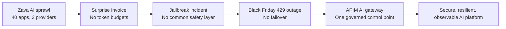

# 90-minute session narrative and run-of-show

**Title:** Azure API Management as your AI Gateway — Govern models, MCP tools and agents at scale  
**Subtitle:** Security, cost control, resiliency and observability for every AI call — Oct 2026 edition  
**Audience:** Architects, platform engineers, developers, technical decision makers  
**Story thread:** Zava Retail has 40 AI apps, 3 model providers, one surprise invoice, a jailbreak incident, and a 429 outage on Black Friday. APIM AI gateway fixes each issue with central policy.

## Story arc

## Presenter setup

- Keep the story concrete: Zava is not buying a gateway because gateways are interesting. Zava is buying a safe way to scale AI.
- Use the same vocabulary throughout: apps, models, MCP tools, agents, products, policies, backend pool, token metrics.
- Avoid overclaiming preview features. Say preview where the brief says preview.
- Quote prices only as list price, US East, October 2026, to verify.

---

## 1. 00–05 — Welcome and hook: AI sprawl story

**Objective:** Make the problem urgent and relatable before introducing APIM.

**Key messages:**

- AI adoption moves from one chatbot to many apps and agents quickly.
- The first failures are operational: secrets, spend, quotas, safety, and visibility.
- Zava Retail is the session's running example.

**Talk track:**

Welcome everyone. Today is not a generic API Management overview. This is about what happens when enterprise AI becomes real. Zava Retail started with a support copilot. Six months later they had 40 AI apps, three model providers, several teams shipping agents, and product owners asking for MCP tools so agents could search products and check orders.

Then the platform cracks showed up. Finance found one surprise invoice because a sandbox ran a large campaign test. Security investigated a jailbreak incident because one app implemented prompt filtering and another did not. On Black Friday, a shared model deployment returned 429s and the customer support copilot went down while marketing experiments kept running.

The question for Zava is simple: how do you let every team build with AI without giving every team a different security, cost, resiliency, and monitoring model? That is the AI gateway problem.

**Audience interaction:**

Poll: "How many AI apps or agent pilots do you already have: 1–3, 4–10, 10–40, or more than 40?" Follow with: "How many have a central token budget today?"

**What is on screen:**

- Title slide with Zava Retail headline.
- One visual showing: 40 apps, 3 providers, surprise invoice, jailbreak, 429 outage.

**Transition:**

"Let's turn Zava's incidents into the six challenges an AI gateway must solve."

---

## 2. 05–15 — Why an AI gateway: six challenges

**Objective:** Establish the buying criteria before showing APIM capabilities.

**Key messages:**

1. Key and credential sprawl.
2. Cost and quota exhaustion, including 429s.
3. Resiliency and provider/deployment failover.
4. Safety and compliance.
5. Observability and chargeback.
6. MCP tool and agent sprawl.

**Talk track:**

Zava's first challenge is credential sprawl. If every app calls Foundry or another provider directly, every app needs a credential strategy. That may begin as a key in a local setting and end as a cross-enterprise secret management problem.

The second challenge is cost and quota exhaustion. Token usage is not like normal API calls. A small number of prompts can consume a large budget, and one workload can exhaust TPM for another. Zava's Bronze marketing sandbox should not be able to starve the Gold customer support copilot.

Third is resiliency. AI backends can return 429s or 5xx responses. If failover logic lives in each app, it will be inconsistent and hard to test. Zava needs a shared backend pool and circuit breaker pattern.

Fourth is safety. Prompt attacks, harmful content, and policy bypass attempts cannot depend on every team implementing the same library correctly. Zava needs one enforcement point across chat traffic, MCP tool calls, and A2A agent traffic.

Fifth is observability. Finance wants token cost by team. Operations wants backend health. Security wants evidence. Developers want to know why a request was throttled.

Sixth is tool and agent sprawl. MCP and A2A make agents more useful, but they also create new endpoints that need auth, quotas, policy, and cataloging.

**Audience interaction:**

Question: "Which of the six is already painful for you: secrets, cost, 429s, safety, observability, or tool sprawl?"

**What is on screen:**

- Six challenge cards.
- Zava incident mapped to each challenge.

**Transition:**

"Now that the problem is clear, let's refresh what APIM has become in 2026."

---

## 3. 15–25 — APIM in 2026: refresher and what's new

**Objective:** Position APIM as the familiar API platform extended to GenAI, MCP, and agents.

**Key messages:**

- APIM is gateway, management plane, and developer portal.
- v2 tiers deploy in minutes and Basic v2/Standard v2 now support workspaces.
- APIM manages language model APIs, MCP servers, A2A agent APIs, and self-hosted endpoints.
- New AI gateway surfaces include MCP servers, A2A import, unified model API preview, and AI gateway in Microsoft Foundry preview.
- `llm-content-safety` covers MCP/A2A traffic; token metrics include preview token categories such as cached, reasoning, and thinking.
- Programmatic MCP management uses API tools sub-resources with API version `2025-09-01-preview` or later.

**Talk track:**

APIM still has the three parts many of you know: the gateway that handles traffic, the management plane that defines APIs, products, policies, users, subscriptions, and backends, and the developer portal for discovery and subscription workflows.

What changed is the traffic. In 2026, the AI gateway capabilities apply API governance patterns to model APIs, MCP servers, and A2A agent APIs. APIM can front OpenAI-compatible endpoints, Foundry deployments, Anthropic-format APIs on v2 tiers, Google Vertex AI, Gemini, Bedrock, and self-hosted endpoints.

The platform also moved forward. Basic v2 and Standard v2 deploy in minutes and can scale to 10 units. Premium v2 is GA with a 30-unit ceiling. Workspaces are now available in Basic v2 and Standard v2, which matters for federated API management.

For Zava, this means the AI gateway is not a sidecar script. It is an enterprise API platform pattern. The same place that governs normal APIs can govern model calls, MCP tool calls, and A2A agent calls.

Two preview items are important to call out honestly. Unified model API provides one OpenAI-chat-completions-shaped endpoint over multiple backends with format translation. AI gateway in Microsoft Foundry lets APIM be attached directly inside a Foundry project, so Foundry users can configure gateway controls from the Foundry experience while APIM still powers the gateway underneath.

**Audience interaction:**

Quick show of hands: "Who already runs APIM for non-AI APIs?" Then: "Who is evaluating MCP or agents this quarter?"

**What is on screen:**

- APIM three-plane refresher.
- What's new timeline: v2 tiers, workspaces, MCP, A2A, unified model API, Foundry integration.

**Transition:**

"With that platform context, let's go one level deeper into the five capability pillars Zava needs."

---

## 4. 25–40 — AI gateway capabilities deep dive: five pillars

**Objective:** Explain the specific APIM controls that solve Zava's incidents.

**Key messages:**

- Security: managed identity, OAuth/credential manager, JWT validation, content safety.
- Cost and scale: token budgets, quotas, semantic caching, PTU-first spillover pattern.
- Resiliency: backend pools, circuit breakers, retry, session affinity.
- Observability: token metrics, custom dimensions, LLM logs, workbook, chargeback.
- MCP and agents: REST-to-MCP, pass-through MCP, A2A import, API Center, Foundry and Copilot Studio consumption patterns.

**Talk track:**

The first pillar is security. Zava's apps should not hold model provider keys. In the demo, apps only hold an APIM subscription key. APIM uses managed identity to call Foundry. For user or app identity, APIM can validate JWTs and use credential manager patterns for OAuth. Then `llm-content-safety` applies Prompt Shields, harm categories, and blocklists.

The second pillar is cost and scale. `llm-token-limit` lets Zava define tokens-per-minute and token quota by subscription, product, IP address, or another policy expression. That gives Gold and Bronze products different budgets. Semantic caching can be added with Redis-compatible cache and embeddings to reduce repeated model calls. A PTU-first spillover pattern can route paid capacity first and pay-as-you-go fallback second.

The third pillar is resiliency. APIM backends can be grouped into a pool with round-robin, weighted, or priority routing. Circuit breaker rules can trip on 429 or 5xx and honor `Retry-After`. Retry policy can then select the pool again. For Zava, Sweden Central and France Central both host a Foundry deployment, so a regional or quota issue does not have to become an app outage.

The fourth pillar is observability. `llm-emit-token-metric` emits prompt, completion, and total tokens with dimensions such as Product, Subscription ID, API ID, and Client IP. LLM logs go to Log Analytics in `ApiManagementGatewayLlmLog`. Platform and FinOps teams can see who is using tokens and which deployment served the traffic.

The fifth pillar is MCP and agents. Zava can expose existing REST operations as MCP tools, pass through existing MCP servers, and import A2A agent APIs. Policies apply to the gateway endpoint. That means tools and agents do not bypass the enterprise control plane.

**Audience interaction:**

Ask: "If you had to standardize one policy tomorrow, would it be managed identity, token limits, content safety, or logging?"

**What is on screen:**

- Five-pillar diagram.
- Example policy snippets: managed identity, token limit, set-backend-service, token metric.

**Transition:**

"Now let's switch from architecture to the live Zava environment and prove the pattern."

---

## 5. 40–65 — Live demo

**Objective:** Demonstrate Zava's end-to-end gateway: chat, failover, budgets, safety, MCP, agent, metrics, and CI/CD.

**Key messages:**

- The app code uses the gateway endpoint and APIM subscription key.
- APIM uses managed identity to Foundry.
- Products represent teams and enforce different token policies.
- MCP tools and agent flows also traverse the gateway.
- Metrics and logs prove usage and troubleshooting value.

**Talk track:**

We are now in the Zava demo environment. The APIM service is Basic v2 in Sweden Central. Behind it are two current Foundry resources and projects, one in Sweden Central and one in France Central, both visible in `ai.azure.com` and both running `gpt-6.1-sol` version `2026-09-29` GlobalStandard at 100K TPM. Local key auth is disabled. APIM targets the Foundry endpoint `https://<account>.services.ai.azure.com/openai`, content safety uses the Cognitive Services endpoint, and APIM has the managed identity roles needed to call both.

The inference API is at `/inference/openai/v1`, so an OpenAI-compatible client can keep its normal SDK shape. Products represent teams: Gold is the customer support copilot with a larger token budget, and Bronze is the marketing sandbox with a smaller budget.

We will run eight scenarios. D6 uses the Responses API because `gpt-6.1-sol` is a reasoning model and function tools are not supported on Chat Completions with reasoning. Watch for the pattern: every time the app, model, MCP server, or agent needs governance, the answer is not a new library in each app. The answer is a gateway policy.

**Audience interaction:**

Before D3, ask: "Should Bronze be allowed to consume the same TPM as Gold during Black Friday?" Before D4, ask: "Where should jailbreak detection live: every app or the gateway?"

**What is on screen:**

- Terminal in `demo` folder.
- Azure portal: APIM policies, Backends > `foundry-pool`, Products > Gold/Bronze, MCP servers blade, Application Insights, Log Analytics.
- Demo script commands and expected outputs.

**Transition:**

"The demo showed the technical controls. Let's make the tier and cost choices explicit."

---

## 6. 65–75 — Pricing, limits, and choosing a tier

**Objective:** Help the audience choose a practical starting tier and understand constraints.

**Key messages:**

- Basic v2 is the cheapest tier that supports this demo's required features.
- Consumption is low-cost but not suitable for MCP and circuit breaker scenarios.
- Standard v2 and Premium v2 add networking and higher scale options.
- Model tokens are billed separately.
- Limits matter: policy size, backend pool count, MCP restrictions, and token-limit scope.

**Talk track:**

Pricing should be practical and honest. These are list prices in US East, October 2026, and you should verify them in the Azure pricing calculator. For this demo, Basic v2 is the best fit at about $150 per month with 10M calls per unit included and $3 per million overage. It supports AI gateway policies, managed identity, backend pools, circuit breaker, MCP servers, and workspaces.

Consumption has a $0 base price and a free-call threshold, but it does not support MCP servers or circuit breaker and has a smaller policy document limit. Developer is useful for non-production labs but has no SLA. Standard v2 adds VNet integration for isolated backends. Premium v2 adds VNet injection, availability zones, and a 30-unit scale ceiling.

Remember that APIM pricing is not model pricing. Foundry model tokens are billed separately. APIM controls and observes that traffic; it does not make tokens free.

Limits also shape architecture. Backend pools support up to 30 backends. Circuit breaker has one rule per backend and is not in Consumption. MCP is tools-only, not resources or prompts, not available in Consumption, and not supported inside workspaces. Token limits are per gateway, not automatically aggregated across regions.

**Audience interaction:**

Ask: "Would your first landing zone be Basic v2, Standard v2, or Premium v2, and why?"

**What is on screen:**

- Pricing table.
- Decision guide: demo/lab, production with public endpoints, production with isolated backends, high-scale/network-isolated.
- Limits callout slide.

**Transition:**

"Once the tier is chosen, the next question is how to adopt without boiling the ocean."

---

## 7. 75–82 — Patterns, reference architecture, labs, and adoption path

**Objective:** Give the audience a path from demo to implementation.

**Key messages:**

- Start with one inference API and a small product model.
- Use Bicep/GitHub Actions to keep the gateway reproducible.
- The Azure-Samples/AI-Gateway repository has 50+ labs across models, MCP, agents, security, observability, and resiliency.
- Adopt in crawl/walk/run stages.

**Talk track:**

The adoption pattern is simple. Crawl: put one critical app behind APIM, use managed identity to the backend, emit token metrics, and define Gold/Bronze products. Walk: add content safety, token quotas, LLM logs, and backend pools. Run: add MCP servers, A2A agent APIs, API Center registration, workspaces where appropriate, semantic caching, and PTU-first spillover.

The demo environment is not a hand-built pet. It is Bicep deployed through GitHub Actions. That matters because AI governance should be repeatable and reviewable. APIM policies, backends, products, and MCP servers should be part of the platform code path.

For deeper practice, the Azure-Samples/AI-Gateway repository has more than 50 labs. They cover Foundry models, Bedrock, Gemini, Ollama, MCP from REST and GraphQL, OAuth for MCP, A2A agents, content safety, Purview DLP, private connectivity, token metrics, FinOps, load balancing, semantic caching, and zero-to-production composition.

**Audience interaction:**

Question: "Which crawl step would be easiest in your organization: central endpoint, token metrics, or product-based budgets?"

**What is on screen:**

- Crawl/walk/run roadmap.
- Reference architecture diagram.
- Link to https://github.com/Azure-Samples/AI-Gateway.

**Transition:**

"Let's close with the decisions you can take back to your teams today."

---

## 8. 82–90 — Key takeaways, call to action, and Q&A

**Objective:** Reinforce the message and convert interest into next steps.

**Key messages:**

- AI scale requires gateway governance.
- APIM provides one control point for models, MCP tools, and agents.
- The first useful implementation can be small: one inference API, two products, token metrics, and managed identity.
- Preview features should be validated before production commitments.

**Talk track:**

Here are the takeaways. First, AI sprawl is not hypothetical. It is what success looks like when every team starts building. Second, the risks are operational: keys, spend, quotas, safety, visibility, tools, and agents. Third, Azure API Management is the AI gateway pattern for those risks. It lets apps keep moving while platform teams enforce policy centrally.

For Zava, the outcome is clear. The support copilot gets protected capacity. The marketing sandbox gets a budget. Jailbreak attempts are blocked consistently. Backends can fail over during 429 events. Finance gets token metrics. Developers get a stable endpoint and self-service path.

Your call to action is to choose one AI workload and put it behind a governed gateway path. Start with managed identity, products, token limits, and token metrics. Then add safety, resiliency, MCP, and agents as the platform matures.

**Audience interaction:**

Q&A prompts:

- "What direct model call would you move behind a gateway first?"
- "Which policy would create immediate value for your organization?"
- "Where do you need to validate preview capabilities before production?"

**What is on screen:**

- Three takeaways.
- Adoption next steps.
- Source links and QR code placeholder.

**Closing line:**

"The goal is not to slow AI down. The goal is to make AI safe enough, observable enough, and reliable enough that Zava can scale it."
