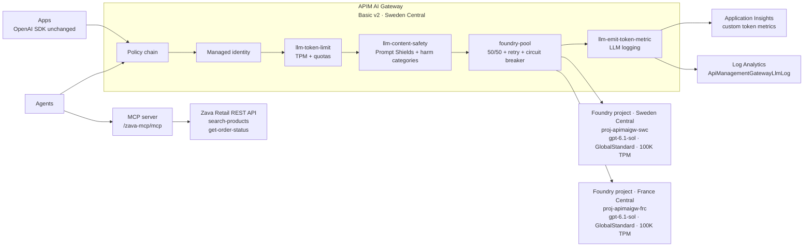

# Presentations

This folder contains the repository presentation sources and build tooling. Engineering standards require Marp Markdown for committed deck sources and documented export commands.

## Decks

| Deck | Source | Convenience PDF | Native PPTX |
|---|---|---|---|
| Azure API Management as your AI Gateway — Govern models, MCP tools and agents at scale | [`apim-ai-gateway.md`](apim-ai-gateway.md) | [`apim-ai-gateway.pdf`](apim-ai-gateway.pdf) | [`apim-ai-gateway-session.pptx`](apim-ai-gateway-session.pptx) |

The native PPTX is produced separately in `docs/presentations/pptx/` and copied to `docs/presentations/apim-ai-gateway-session.pptx` by the PPTX workflow/agent.

## Build

Prerequisites:

- Node.js and npm.
- Browser engine for PDF export. On Windows, use Edge if Chromium is not auto-discovered:

```powershell
$env:CHROME_PATH = 'C:\Program Files (x86)\Microsoft\Edge\Application\msedge.exe'
```

Install dependencies from the configured Microsoft-protected npm feed, then build:

```powershell
Set-Location docs\presentations
npm ci
npm run build:html
npm run build:pdf
npm run build:pptx
```

Outputs are written to `docs/presentations/dist/`, which is git-ignored. The committed convenience PDF at `docs/presentations/apim-ai-gateway.pdf` is copied from `dist/apim-ai-gateway.pdf` after a successful build.

To export PNG images for visual QA:

```powershell
Set-Location docs\presentations
npx marp apim-ai-gateway.md --theme-set theme --html --allow-local-files --images png --output ..\..\tmp\apim-ai-gateway.png
```

## Architecture diagram

The Marp deck uses the hand-authored SVG at [`assets/architecture.svg`](assets/architecture.svg). Mermaid is included here for documentation purposes only; Marp does not render Mermaid natively.



## Dependency overrides

Both `package.json` files pin patched transitive dependencies with npm `overrides` because the direct dependencies
have no release that pulls them in yet: `@xmldom/xmldom`, `basic-ftp` and `@puppeteer/browsers` (drops the
vulnerable `extract-zip`) for Marp CLI, and `image-size` for pptxgenjs. `npm audit` reports 0 vulnerabilities.
Remove an override once the upstream package ships the fix.
