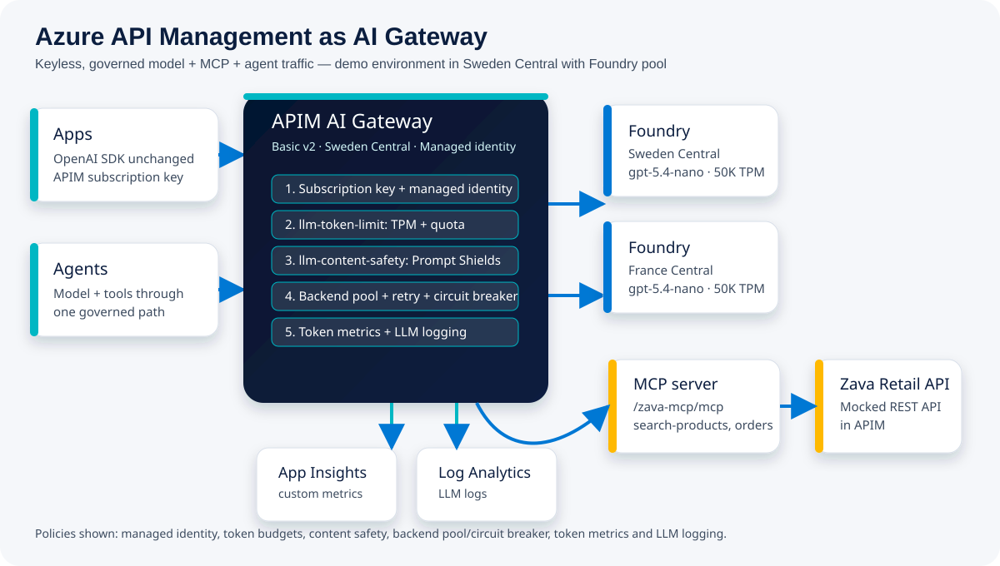

<!-- _class: lead -->
<div class="kicker">90-minute engineering session</div>

# Azure API Management as your AI Gateway

<div class="subtitle">Govern models, MCP tools and agents at scale — security, cost control, resiliency and observability for every AI call.</div>

<div class="flow"><div class="step"><strong>Models</strong><br><span class="small">Foundry, OpenAI-compatible, Anthropic, Gemini, Bedrock, self-hosted</span></div><div class="arrow">→</div><div class="step"><strong>APIM</strong><br><span class="small">one governed gateway</span></div><div class="arrow">→</div><div class="step"><strong>Agents + MCP</strong><br><span class="small">tools and agent APIs under policy</span></div></div>

<!-- Speaker notes: Open by setting the context: this is not a generic APIM talk, it is a practical AI gateway session. The audience should leave knowing why platform teams need a control point and how this repo demonstrates it. Keep the session anchored in the Zava Retail story and the Basic v2 demo environment. Mention that all pricing and limits are October 2026 list/reference data and must be verified before production budgeting. -->

---
<!-- _class: section -->
<div class="kicker">00–05 · Welcome & hook</div>

# The Zava Retail AI sprawl story

<div class="grid cols3 cards"><div class="dark-card"><div class="big">40</div><strong>AI apps</strong><br><span class="muted">support, marketing, order ops and internal assistants</span></div><div class="dark-card"><div class="big">3</div><strong>model providers</strong><br><span class="muted">different keys, quotas, SDKs and telemetry</span></div><div class="dark-card"><div class="big">1</div><strong>surprise invoice</strong><br><span class="muted">no central token budget, chargeback or safety baseline</span></div></div>

> From “one chatbot” to hundreds of AI apps and agents, the risk moves from model selection to traffic governance.

<!-- Speaker notes: Use the Zava story exactly as the hook in the shared brief: forty AI apps, three model providers, and one surprise invoice. Do not spend time on fictional technical detail beyond that framing. The point is to make the pain concrete before introducing APIM. Bridge to the idea that a gateway becomes the enterprise control point for every AI call. -->

---

# Today’s 90-minute path

<div class="grid cols2 cards"><div class="card compact"><strong>00–05</strong> Welcome & hook — AI sprawl at Zava Retail</div><div class="card compact"><strong>05–15</strong> Why an AI gateway — six enterprise challenges</div><div class="card compact"><strong>15–25</strong> APIM in 2026 — refresher and what’s new</div><div class="card compact"><strong>25–40</strong> Five capability pillars — security, cost, resiliency, observability, MCP & agents</div><div class="card compact"><strong>40–65</strong> Live demo — D1 through D8</div><div class="card compact"><strong>65–75</strong> Pricing, limits and choosing a tier</div><div class="card compact"><strong>75–82</strong> Patterns, reference architecture and AI-Gateway labs</div><div class="card compact"><strong>82–90</strong> Takeaways, call to action and Q&A</div></div>

<!-- Speaker notes: This slide mirrors the mandatory agenda and timings from the brief. Treat the timings as the facilitation contract for the room. Set expectations that the deepest technical content is in the capability and demo sections. Also signal that pricing and limits are intentionally included because platform choices depend on them. -->

---
<!-- _class: section -->
<div class="kicker">05–15 · Why an AI gateway</div>

# Six challenges without a gateway

<div class="grid cols3 cards"><div class="card"><h3><span class="icon">1</span>Key sprawl</h3><p>Apps hold model keys and credentials directly.</p></div><div class="card"><h3><span class="icon">2</span>Cost & quota</h3><p>Token budgets exhaust silently; 429s hit users.</p></div><div class="card"><h3><span class="icon">3</span>Resiliency</h3><p>Every client reimplements retry, failover and backoff.</p></div><div class="card"><h3><span class="icon">4</span>Safety</h3><p>No uniform prompt shield, harm threshold or blocklist.</p></div><div class="card"><h3><span class="icon">5</span>Observability</h3><p>No per-product token metrics, LLM logs or chargeback.</p></div><div class="card"><h3><span class="icon">6</span>MCP & agents</h3><p>Tools and agents multiply outside the API estate.</p></div></div>

<!-- Speaker notes: Keep this slide crisp and problem-oriented. The six challenge labels come directly from the shared brief and should not be renamed. Explain that each challenge becomes more visible when AI usage moves from experiments to many production apps. Close by saying APIM gives one policy and telemetry layer across models, MCP servers and A2A agent APIs. -->

---
<!-- _class: section -->
<div class="kicker">15–25 · APIM in 2026</div>

# APIM refresher: gateway + management plane + developer portal

<div class="flow"><div class="step"><strong>Gateway</strong><br><span class="small">runtime policy enforcement, routing, backend mediation</span></div><div class="arrow">+</div><div class="step"><strong>Management plane</strong><br><span class="small">APIs, products, subscriptions, policies, backends</span></div><div class="arrow">+</div><div class="step"><strong>Developer portal</strong><br><span class="small">self-service discovery and subscription</span></div></div>

<div class="grid cols2 cards" style="margin-top:26px"><div class="card"><h3>For AI traffic</h3><p>APIM fronts language model APIs, Foundry deployments, OpenAI-compatible endpoints, remote MCP servers and A2A agent APIs.</p></div><div class="card"><h3>For platform teams</h3><p>Products map to teams, policies enforce budgets and safety, and Azure Monitor provides token-level evidence.</p></div></div>

<!-- Speaker notes: Give only enough APIM background for mixed audiences. Architects may know the classic API gateway pattern; developers may need the link between products, subscriptions and policies. Position AI gateway as an extension of the same APIM control model, not a separate product. Then move quickly into the 2026 changes. -->

---

# APIM 2026: what changed, dated

<div class="table-small">

| Date | Change to know |
|---|---|
| 2025 Ignite / 2026 ongoing | MCP server support: expose REST as MCP or pass through existing MCP; tools-only; not in workspaces. |
| 2026-09-16 | Workspaces extended to Basic v2 and Standard v2. |
| 2026-09-04 | v2 overview refreshed; Premium v2 GA and Premium v2 scale to 30 units. |
| 2026-08-18 | `llm-content-safety` also protects MCP tool calls and A2A agent API traffic. |
| 2026-09-17 | `llm-emit-token-metric` adds preview cached, reasoning and thinking token categories. |
| Oct 2026 | Foundry (new): resource + project per region in ai.azure.com; no classic hub or Azure OpenAI resource. |
| 2026-06-23 | Programmatic MCP management: API tools sub-resource, `2025-09-01-preview`. |

</div>

<span class="pill">v2 tiers deploy in minutes</span><span class="pill">Unified model API preview</span><span class="pill">Foundry AI gateway preview</span>

<!-- Speaker notes: These dates are from the research brief’s what’s-new table and should be treated as October 2026 context. Emphasize that the AI gateway surface changed quickly through 2026, especially MCP, A2A and token telemetry. Mention that preview items should be validated for production readiness before committing to them. The demo itself uses stable, deployed repo capabilities rather than relying on the preview unified model API. The Foundry environment is the current resource-plus-project model visible in ai.azure.com, not a classic hub-based project and not Azure OpenAI resources. -->

---

# 2026 control surface: models, MCP and agents

<div class="grid cols3 cards"><div class="card"><h3>Language model APIs</h3><p>OpenAI Chat Completions or Responses API, Anthropic Messages API on v2 tiers, Google Vertex AI, Foundry and self-hosted endpoints.</p></div><div class="card"><h3>Unified model API</h3><p>Preview endpoint with OpenAI-shaped requests, model discovery, format translation and failover across backends.</p></div><div class="card"><h3>MCP + A2A</h3><p>Expose REST APIs as MCP servers, pass through existing MCP servers, and import A2A agent APIs with APIM mediation.</p></div></div>

<div class="card" style="margin-top:22px"><strong>Core message:</strong> one governed ingress for models, tools and agents — with managed identity, token budgets, safety checks, resilient backend pools and token-level observability.</div>

<!-- Speaker notes: This slide connects the dated announcements to what the audience can do. Avoid over-indexing on a single model provider. The research states APIM can manage Microsoft Foundry, non-Microsoft providers such as Amazon Bedrock and Google Gemini, remote MCP servers, A2A APIs and self-hosted endpoints. Explain that the governance pattern is consistent even when backend formats differ. -->

---
<!-- _class: section -->
<div class="kicker">25–40 · Capability deep dive</div>

# Five capability pillars

<div class="grid cols3 cards"><div class="dark-card"><h3><span class="icon">S</span>Security</h3><p>No backend keys in apps; managed identity, OAuth, JWT validation and content safety.</p></div><div class="dark-card"><h3><span class="icon">€</span>Cost & scale</h3><p>TPM, quotas, semantic caching and PTU-first spillover patterns.</p></div><div class="dark-card"><h3><span class="icon">R</span>Resiliency</h3><p>Backend pools, weights, priorities, affinity, circuit breakers and retry.</p></div><div class="dark-card"><h3><span class="icon">O</span>Observability</h3><p>Token metrics, LLM logs, workbooks and FinOps chargeback.</p></div><div class="dark-card"><h3><span class="icon">M</span>MCP & agents</h3><p>REST-to-MCP, MCP passthrough, A2A APIs and API Center registry.</p></div></div>

<!-- Speaker notes: Use this as the transition from product overview to implementation details. The five pillars match the mandatory brief and the demo architecture. Each following slide includes a short snippet so engineers can see the policy or resource shape. Keep reminding the audience that policies compose at product, API or operation scope. -->

---

# Pillar 1 — Security baseline

<div class="grid cols2"><div>

- Apps keep only an APIM subscription key or user token.
- APIM authenticates to Foundry with managed identity.
- `llm-content-safety` adds Prompt Shields, harm categories and blocklists.
- Same safety policy can protect chat, MCP tool calls and A2A traffic.

</div><div class="code-small">

```xml
<authentication-managed-identity
  resource="https://cognitiveservices.azure.com" />
<llm-content-safety backend-id="content-safety"
                    shield-prompt="true">
  <categories output-type="EightSeverityLevels">
    <category name="Hate" threshold="4" />
    <category name="SelfHarm" threshold="4" />
    <category name="Sexual" threshold="4" />
    <category name="Violence" threshold="4" />
  </categories>
</llm-content-safety>
```

</div></div>

<!-- Speaker notes: The demo environment disables local key auth on the Foundry resources, so APIM’s managed identity is the trust boundary. The content-safety thresholds and categories reflect the brief: Hate, SelfHarm, Sexual and Violence at threshold 4 with eight severity levels. Explain that security is both authentication and safety screening. Keep the snippet short and conceptual rather than pretending it is the complete deployed policy. -->

---

# Pillar 2 — Cost & scale controls

<div class="grid cols2"><div class="code-small">

```xml
<llm-token-limit counter-key="@(context.Subscription.Id)"
  tokens-per-minute="300"
  token-quota="100000"
  token-quota-period="Monthly"
  estimate-prompt-tokens="false"
  remaining-tokens-header-name="x-ratelimit-remaining-tokens"
  tokens-consumed-header-name="x-tokens-consumed" />
```

</div><div>

<div class="card"><h3>Product = team budget</h3><p><strong>Gold</strong> support copilot: 20,000 tokens/min and 5M tokens/month. <strong>Bronze</strong> marketing sandbox: 300 tokens/min and 100K tokens/month.</p></div>
<div class="card"><h3>Scale levers</h3><p>Semantic caching with Azure Managed Redis can cut repeated calls; PTU-first spillover keeps reserved throughput preferred before pay-as-you-go.</p></div>

</div></div>

<!-- Speaker notes: This is the FinOps control slide. Use the Gold and Bronze product budgets exactly as specified in the brief because they appear again in demo D3. Explain the difference between token-per-minute throttling and longer-period token quota. Also mention that model tokens are still billed by Foundry separately; the gateway does not remove model cost. -->

---

# Pillar 3 — Resiliency with backend pools

<div class="grid cols2"><div>

- Backend pool `foundry-pool`: Sweden Central + France Central.
- Weighted 50/50 in the demo.
- Per-backend circuit breaker trips on 429/5xx and honors `Retry-After`.
- Retry policy lets the gateway absorb transient model-region failures.

</div><div class="code-small">

```xml
<inbound>
  <base />
  <set-backend-service backend-id="foundry-pool" />
</inbound>
<backend>
  <retry count="1" interval="0" first-fast-retry="true"
    condition="@(context.Response.StatusCode == 429 ||
                 context.Response.StatusCode == 503)">
    <set-backend-service backend-id="foundry-pool" />
    <forward-request buffer-request-body="true" />
  </retry>
</backend>
```

</div></div>

<!-- Speaker notes: The resiliency story is not “retry everywhere”; it is “centralize retry and failover behavior once.” The research states backend pools support round-robin, weighted, priority and session-aware routing. Circuit breaker is not available in Consumption and pools support up to thirty backends. Tie this slide to demo D2, where repeated calls show both regions being used. -->

---

# Pillar 4 — Observability and chargeback

<div class="grid cols2"><div class="code-small">

```xml
<llm-emit-token-metric namespace="ai-gateway">
  <dimension name="Subscription ID"
    value="@(context.Subscription.Id)" />
  <dimension name="Product"
    value="@(context.Product != null ? context.Product.Name : "none")" />
  <dimension name="API ID"
    value="@(context.Api.Id)" />
  <dimension name="Client IP"
    value="@(context.Request.IpAddress)" />
</llm-emit-token-metric>
```

</div><div>

<div class="card"><h3>Metrics</h3><p>Application Insights custom metrics emit prompt, completion and total tokens with up to five dimensions.</p></div>
<div class="card"><h3>Logs</h3><p>LLM prompt and completion logging lands in Log Analytics as `ApiManagementGatewayLlmLog`; the built-in workbook helps inspect usage patterns.</p></div>

</div></div>

<!-- Speaker notes: This pillar is what turns governance into evidence. The dimensions shown match the demo brief: Subscription ID, Product, API ID and Client IP. The research notes preview token categories such as cached, reasoning and thinking tokens; treat those as preview. Link this slide to D7, where token usage and LLM logs are inspected. -->

---

# Pillar 5 — MCP tools and agents

<div class="grid cols2"><div>

- REST APIs can be exposed as MCP servers.
- Existing MCP servers can be passed through APIM.
- A2A agent APIs can be imported and mediated.
- Responses API agents can use MCP tools converted to function tools.
- API Center can register APIs, MCP servers and agents for discovery.

</div><div class="code-small">

```bicep
resource retailMcp 'Microsoft.ApiManagement/service/apis@2024-06-01-preview' = {
  parent: apim
  name: 'zava-retail-mcp'
  properties: {
    type: 'mcp'
    path: 'zava-mcp'
    protocols: [ 'https' ]
    mcpTools: [
      { name: 'search-products', operationId: searchOp.id }
      { name: 'get-order-status', operationId: orderOp.id }
    ]
  }
}
```

</div></div>

<!-- Speaker notes: This snippet matches the research description of MCP servers as APIM API resources with type `mcp` and an `mcpTools` array. For production CI/CD, the research notes that `2025-09-01-preview` adds API tool sub-resources so tools can be managed independently. In the demo, Zava Retail’s mocked REST operations become MCP tools at `/zava-mcp/mcp`. Remind the audience that MCP is not supported in Consumption and not inside workspaces. -->

---

# Reference architecture for this repo



<!-- Speaker notes: Walk left to right through the hand-authored architecture diagram. Apps and agents call APIM; APIM applies the policy chain; model traffic goes to the Sweden Central and France Central Foundry pool; MCP calls expose the Zava Retail REST API; telemetry flows to Application Insights and Log Analytics. Keep this consistent with the actual repo deployment: Basic v2 APIM in Sweden Central, system-assigned managed identity, current Foundry resource plus project per region, gpt-6.1-sol version 2026-09-29 GA GlobalStandard with 100K TPM per region, OpenAI v1 endpoint through APIM, and key auth disabled. -->

---
<!-- _class: section -->
<div class="kicker">40–65 · Live demo</div>

# What is deployed for the demo

<div class="grid cols2 cards"><div class="dark-card"><h3>Gateway</h3><p>API Management <strong>Basic v2</strong> in Sweden Central, named `apim-apimaigw-demo-&lt;suffix&gt;`, with system-assigned managed identity.</p></div><div class="dark-card"><h3>Models</h3><p>Foundry resource + project in each region: `proj-apimaigw-swc` and `proj-apimaigw-frc`, running <strong>gpt-6.1-sol</strong> v2026-09-29 GA GlobalStandard at 100K TPM.</p></div><div class="dark-card"><h3>Inference API</h3><p>OpenAI v1 endpoint at `/inference/openai/v1`; APIM calls `https://&lt;account&gt;.services.ai.azure.com/openai/v1` with managed identity.</p></div><div class="dark-card"><h3>Zava tools</h3><p>Mocked `/zava` REST operations exposed as MCP tools at `/zava-mcp/mcp`; D6 uses Responses API tools.</p></div></div>

<!-- Speaker notes: This slide prevents accidental drift from the actual repo environment. Stress that local key auth is disabled on the Foundry resources, so APIM uses managed identity with the Cognitive Services OpenAI User role. Mention that the backend pool is weighted 50/50 with circuit breakers and retry. The model is gpt-6.1-sol, version 2026-09-29, GA, GlobalStandard, 100K TPM per region. Point to the Python demo client as the command-line driver: `python -m ai_gateway <scenario>`. -->

---

# Demo map D1–D8

<div class="demo-grid"><div class="demo"><b>D1</b><span>Keyless chat through gateway; 200 via Sweden Central with token headers.</span></div><div class="demo"><b>D2</b><span>Six requests alternate France Central and Sweden Central; explain breaker.</span></div><div class="demo"><b>D3</b><span>Bronze returns 200 x6 then 429 Retry-After 11; Gold continues.</span></div><div class="demo"><b>D4</b><span>Benign prompt OK; jailbreak blocked by Prompt Shields.</span></div><div class="demo"><b>D5</b><span>MCP initialize, tools/list and tool calls through gateway.</span></div><div class="demo"><b>D6</b><span>Responses API agent converts MCP tools to function tools.</span></div><div class="demo"><b>D7</b><span>Application Insights metrics and LLM log KQL.</span></div><div class="demo"><b>D8</b><span>Bonus: Bicep + GitHub Actions deploy, smoke test and demo run.</span></div></div>

<!-- Speaker notes: Use this as the operator checklist during the live segment. Keep the order exactly as shown because later scenarios build on earlier ones. The backup slides that follow provide expected outputs if the live environment is slow or unavailable. Allocate roughly three minutes each for D1 through D7 and one minute for D8. -->

---

# Backup expected output — D1 and D2

<div class="grid cols2 cards"><div class="card"><h3>D1 keyless chat</h3><ul><li>HTTP 200 from `/inference/openai/v1` via Sweden Central.</li><li>App sends APIM subscription key only.</li><li>Token headers: 44 prompt, 94 completion, 19,862 remaining.</li><li>No model API key appears in app config.</li></ul></div><div class="card"><h3>D2 load balance & failover</h3><ul><li>Six requests alternate France Central / Sweden Central.</li><li>429/5xx conditions are absorbed by retry where possible.</li><li>Circuit breaker honors backend `Retry-After` before reusing a tripped backend.</li></ul></div></div>

<!-- Speaker notes: These are backup talking points from the verified live run. Use them if the live endpoint is unavailable or a rate limit makes the demo noisy. For D1, the important proof is keyless backend access via managed identity and visible response headers: 200 via Sweden Central, 44 prompt tokens, 94 completion tokens and 19,862 remaining. For D2, the important proof is that six calls alternate France Central and Sweden Central, and resiliency policy lives in APIM rather than in every client. -->

---

# Backup expected output — D3 and D4

<div class="grid cols2 cards"><div class="card"><h3>D3 token budgets</h3><ul><li>Bronze receives 200 x6 with remaining 239, 176, 123, 81, 9, 0.</li><li>Next Bronze call receives <strong>429 Too Many Requests</strong> with `Retry-After: 11`.</li><li>Gold keeps working with 20,000 TPM.</li></ul></div><div class="card"><h3>D4 content safety</h3><ul><li>Benign prompt passes with HTTP 200.</li><li>Jailbreak is blocked with 403.</li><li>Payload: `{"statusCode":403,"message":"Request failed content safety check."}`</li></ul></div></div>

<!-- Speaker notes: D3 is the clearest business-value demo because the same gateway enforces different team budgets. Use the verified sequence: Bronze 200 x6 with remaining token values 239, 176, 123, 81, 9 and 0, then 429 with Retry-After 11; Gold still returns 200. D4 shows that safety policy is centralized and can stop an unsafe prompt before model invocation, returning the verified 403 payload. -->

---

# Backup expected output — D5 and D6

<div class="grid cols2 cards"><div class="card"><h3>D5 REST API as MCP</h3><ul><li>MCP `initialize` succeeds at `/zava-mcp/mcp`.</li><li>`tools/list` returns `search-products` and `get-order-status`.</li><li>`get-order-status` returns `ORD-1042` as Out for delivery.</li></ul></div><div class="card"><h3>D6 Responses API agent</h3><ul><li>POST `/inference/openai/v1/responses` through APIM.</li><li>MCP tool list becomes function tools; `store=false` keeps it stateless.</li><li>Encrypted reasoning items are resent for load-balanced turns.</li><li>Final answer cites backpack, headlamp and Zava Express order status.</li></ul></div></div>

<!-- Speaker notes: These scenarios show why MCP belongs in the API estate. D5 proves that existing REST operations can be presented as MCP tools through APIM. D6 ties the model and tool calls together through the Responses API: both model turns and MCP-derived function tools are governed by the same gateway policies for token limit, content safety and token metrics. The verified agent called both tools and answered: “Trail backpack 30L (€89.90) and Headlamp 400lm (€34.50) ... ORD-1042 is out for delivery with Zava Express.” Model turns were served by both France Central and Sweden Central. Make clear that the Zava Retail API is mocked in APIM for the session. -->

---

# Backup expected output — D7 and D8

<div class="grid cols2 cards"><div class="card"><h3>D7 observability</h3><ul><li>Application Insights custom metrics show token usage per product.</li><li>KQL over `AppMetrics` supports product/team chargeback.</li><li>`ApiManagementGatewayLlmLog` shows prompt and completion logging.</li><li>Workbook summarizes consumption patterns.</li></ul></div><div class="card"><h3>D8 CI/CD</h3><ul><li>GitHub Actions deploys Bicep from `infra/`.</li><li>Workflow provisions APIM, Foundry, policies, logs and demo assets.</li><li>Smoke test and demo command run after deployment.</li></ul></div></div>

<!-- Speaker notes: D7 turns the demo from “it works” into “we can operate it.” Emphasize that token metrics and LLM logs are the raw materials for FinOps, debugging and compliance conversations. D8 is intentionally short: the repo is infrastructure-as-code, not a manual portal walkthrough. If time is tight, mention D8 rather than running it live. -->

---
<!-- _class: section -->
<div class="kicker">65–75 · Pricing, limits and choosing a tier</div>

# Benefits: why platform teams adopt an AI gateway

<div class="grid cols3 cards"><div class="dark-card"><h3>Governance</h3><p>One place for auth, safety, schema and registry controls across AI apps.</p></div><div class="dark-card"><h3>Cost control</h3><p>Token limits, quotas, semantic cache and chargeback dashboards.</p></div><div class="dark-card"><h3>Resiliency</h3><p>Priority or weighted pools, PTU-first spillover and circuit breakers.</p></div><div class="dark-card"><h3>Security</h3><p>Managed identity removes backend keys from apps; OAuth secures MCP clients and backends.</p></div><div class="dark-card"><h3>Observability</h3><p>Prompt/completion logs and token metrics make usage explainable.</p></div><div class="dark-card"><h3>Developer self-service</h3><p>Teams discover governed models and tools through portals and catalogs.</p></div></div>

<!-- Speaker notes: This is the business-value translation of the technical pillars. The wording comes from the research benefits section. Use examples from the live demo to make each benefit concrete. Avoid implying APIM itself changes model token pricing; it controls and observes usage while Foundry bills model tokens separately. -->

---

# Pricing snapshot — APIM list price, US East, Oct 2026

<div class="table-small">

| Tier | Approx. monthly | Included calls / overage | Notes |
|---|---:|---|---|
| Consumption | $0 base | ~1M calls free, then $3.50/M | No MCP, no circuit breaker. |
| Developer | ≈ $48 | Included in capacity | No SLA; lab fallback. |
| Basic | ≈ $147 | Included in capacity | Classic tier. |
| **Basic v2** | **≈ $150** | 10M calls/unit, $3.00/M overage | Demo tier; supports required features. |
| Standard v2 | ≈ $700 | 50M calls/unit, $2.50/M overage | Adds VNet integration. |
| Premium v2 | ≈ $2,800/unit | Unlimited call meter found | VNet injection, AZ, 30 units. |
| Workspace pack | ≈ $0.137/hr | Add-on where supported | Verify for chosen tier. |

</div>

<div class="card compact"><strong>Say this out loud:</strong> verify in the Azure pricing calculator for your subscription, region and agreement. Foundry model tokens are billed separately.</div>

<!-- Speaker notes: Keep this as a directional list-price slide. The research used US East Azure Retail Prices API values in October 2026 and explicitly says to verify in the Azure pricing calculator. Basic v2 is the key demo conclusion because it is the cheapest SKU that supports the required AI gateway capabilities in this repo. Do not present these numbers as a customer quote. -->

---

# Key limits — scale and entities

<div class="table-small">

| Limit | Basic / Basic v2 | Standard / Standard v2 | Premium / Premium v2 |
|---|---:|---:|---:|
| Max v2 scale units | Basic v2: 10 | Standard v2: 10 | Premium v2: 30 |
| API operations | 10,000 | 50,000 | 75,000 |
| Products | 200 | 500 | 2,000 |
| Subscriptions | 15,000 | 25,000 | 75,000 |
| Workspaces | Basic v2 only | Standard v2 only | Premium + Premium v2 |

</div>

<div class="grid cols2 cards" style="margin-top:20px"><div class="card compact"><strong>Backend pools:</strong> up to 30 backends; one circuit-breaker rule per backend.</div><div class="card compact"><strong>Token limits:</strong> enforced per gateway, not aggregated across regions.</div></div>

<!-- Speaker notes: The limits come from the March 2026 APIM limits and the v2 tier overview summarized in the research. Keep this slide focused on sizing conversations: products, subscriptions, operations and scale units. Backend pool and token-limit reminders matter specifically for AI gateway architecture. If a customer is close to any limit, validate against the live APIM limits page. -->

---

# Key limits — runtime and AI gateway specifics

<div class="table-small">

| Area | Limit / rule |
|---|---|
| Policy document size | 512 KiB on classic and v2; 16 KiB on Consumption. |
| v2 buffered payload | 2 MiB; request URL 16 KB. |
| Circuit breaker | Not available in Consumption. |
| MCP servers | Developer, Basic, Basic v2, Standard, Standard v2, Premium, Premium v2; not Consumption; not in workspaces. |
| MCP policy warning | Do not read `context.Response.Body` in MCP policies because it breaks streaming behavior. |
| Self-hosted gateway | Developer and Premium classic only; not v2. |
| Anthropic / unified model API | v2 tiers. |

</div>

<!-- Speaker notes: This slide is intentionally practical: these are the limits most likely to break a demo or early production design. The MCP notes are especially important because workspaces now exist in Basic v2 and Standard v2, but MCP itself is not supported inside workspaces. The policy-size and buffering limits should influence how much logic teams put directly in APIM policy. Reconfirm limits before final architecture decisions. -->

---

# Choosing a tier for AI gateway

<div class="grid cols2 cards"><div class="card"><h3>Use Basic v2 when…</h3><ul><li>You need the lowest-cost production-capable demo tier.</li><li>You need MCP, backend pools, circuit breakers and AI policies.</li><li>You do not need VNet integration, VNet injection or self-hosted gateway.</li></ul></div><div class="card"><h3>Move up when…</h3><ul><li><strong>Standard v2</strong>: outbound VNet integration to isolated backends.</li><li><strong>Premium v2</strong>: VNet injection, availability zones and highest v2 scale.</li><li><strong>Premium classic</strong>: multi-region deployment or self-hosted gateway.</li></ul></div></div>

<blockquote>For this repo and session: Basic v2 is the right fit.</blockquote>

<!-- Speaker notes: This slide answers the obvious buying and architecture question after the pricing and limits slides. Tie the decision directly to the deployed demo: Basic v2 supports the required policies, MCP server, backend pool and circuit breaker. Standard v2 and Premium v2 are not “better demos”; they are for isolation and scale requirements. Consumption fails this demo because it lacks MCP and circuit breaker support. -->

---
<!-- _class: section -->
<div class="kicker">75–82 · Patterns, architecture and labs</div>

# Production patterns to take from the demo

<div class="grid cols2 cards"><div class="dark-card"><h3>Product-scoped budgets</h3><p>Use APIM products as team plans: Gold for production copilots, Bronze for sandbox usage.</p></div><div class="dark-card"><h3>Pool and spillover</h3><p>Use weighted or priority pools to prefer reserved capacity and spill over when needed.</p></div><div class="dark-card"><h3>Central safety policy</h3><p>Apply prompt shields and harm thresholds consistently across model, tool and agent traffic.</p></div><div class="dark-card"><h3>Telemetry by design</h3><p>Emit token metrics with dimensions that support chargeback before onboarding many teams.</p></div></div>

<!-- Speaker notes: This is the transition from demo to adoption. These patterns are directly observable in the repo: team products, Foundry backend pool, content safety and Azure Monitor telemetry. Encourage the audience to start with a small governed path rather than attempting to standardize every AI app at once. Mention that reference architecture should include registry and developer self-service as adoption grows. -->

---

# Adoption path: crawl, walk, run

<div class="flow"><div class="step"><div class="big">1</div><strong>Crawl</strong><br><span class="small">One Foundry deployment, managed identity, token metrics and a starter product.</span></div><div class="arrow">→</div><div class="step"><div class="big">2</div><strong>Walk</strong><br><span class="small">Add team products, token quotas, content safety and backend pools.</span></div><div class="arrow">→</div><div class="step"><div class="big">3</div><strong>Run</strong><br><span class="small">Govern MCP, A2A agents, API Center registry, workspaces and FinOps dashboards.</span></div></div>

<div class="card" style="margin-top:28px"><strong>Engineering standard:</strong> make the gateway a reusable platform capability, not a one-off policy file copied between apps.</div>

<!-- Speaker notes: The crawl/walk/run path gives architects a practical next step after the session. Crawl is about proving keyless access and telemetry. Walk adds enforcement and resiliency. Run adds the broader estate: MCP tools, agents, API Center and chargeback operating practices. -->

---

# AI-Gateway labs: accelerate the next experiment

<div class="grid cols3 cards"><div class="card compact"><h3>Models</h3><p>Foundry models, Bedrock, Gemini, Azure ML, image generation, realtime, self-hosted Ollama.</p></div><div class="card compact"><h3>MCP</h3><p>REST-to-MCP, GraphQL-to-MCP, OAuth, API Center registry and private MCP patterns.</p></div><div class="card compact"><h3>Agents</h3><p>Foundry hosted agents, OpenAI agents, A2A + MCP multi-agent systems.</p></div><div class="card compact"><h3>Security</h3><p>Access control, content safety, Purview DLP and private connectivity.</p></div><div class="card compact"><h3>Observability</h3><p>Built-in logging, token metrics and FinOps framework labs.</p></div><div class="card compact"><h3>Resiliency</h3><p>Backend pool load balancing, token rate limiting, semantic caching and session awareness.</p></div></div>

<div class="small"><strong>Source:</strong> `github.com/Azure-Samples/AI-Gateway` — research counted 50 active labs as of Oct 2026.</div>

<!-- Speaker notes: This slide points the audience to hands-on material after the session. Use the six groupings from the research brief rather than listing all fifty labs. The key message is that most production questions already have a lab starting point. Mention that each lab is self-contained with Bicep, policy XML and notebooks. -->

---
<!-- _class: section -->
<div class="kicker">82–90 · Takeaways, CTA and Q&A</div>

# Key takeaways

<div class="grid cols2 cards"><div class="dark-card"><h3>1. AI traffic needs a control plane</h3><p>Without a gateway, keys, quotas, safety and telemetry sprawl with every app and agent.</p></div><div class="dark-card"><h3>2. APIM is the AI gateway</h3><p>It fronts models, MCP tools and A2A agents with one policy layer.</p></div><div class="dark-card"><h3>3. Basic v2 is enough for this demo</h3><p>MCP, AI policies, managed identity, backend pool and circuit breaker all fit the deployed scenario.</p></div><div class="dark-card"><h3>4. Observability is a feature</h3><p>Token metrics and LLM logs enable FinOps, debugging and compliance evidence.</p></div></div>

<!-- Speaker notes: Summarize the session in four practical statements. Keep the emphasis on control, not novelty. The Basic v2 takeaway matters because it lowers the barrier for teams to reproduce the demo. End by preparing the audience for a concrete call to action rather than leaving them with only concepts. -->

---

# Call to action

<div class="grid cols2 cards"><div class="card"><h3>This week</h3><ul><li>Deploy the repo demo into a test subscription.</li><li>Run D1–D4 to prove keyless access, budgets and safety.</li><li>Verify pricing in the Azure pricing calculator.</li></ul></div><div class="card"><h3>This month</h3><ul><li>Map your first three AI apps to APIM products.</li><li>Pick chargeback dimensions before onboarding more teams.</li><li>Choose one MCP tool server candidate and register it through the gateway.</li></ul></div></div>

<blockquote>Start with one governed path. Expand only after you can see, limit and explain every token.</blockquote>

<!-- Speaker notes: Make the action list small enough to be credible. This week is about reproducing the demo and verifying the economics. This month is about turning the pattern into a platform pilot. The closing line reinforces the central message of observability and control before scale. -->

---

# Q&A

<div class="grid cols2 cards"><div class="card"><h3>Questions to discuss</h3><ul><li>Which teams need separate products and token budgets?</li><li>Where do you need managed identity versus OAuth?</li><li>Which model-region pair should be primary and fallback?</li><li>Which REST APIs should become MCP tools first?</li></ul></div><div class="card"><h3>Parking-lot prompts</h3><ul><li>What must be logged, masked or excluded?</li><li>Which dimensions enable chargeback?</li><li>Which preview features are acceptable for your environment?</li><li>What is the production tier decision gate?</li></ul></div></div>

<!-- Speaker notes: Use these prompts if the room is quiet. They are designed to turn questions into architecture decisions. If a question requires current pricing, model availability or preview status, commit to verifying the live source rather than guessing. Keep answers grounded in the brief and research sources. -->

---

# Sources

<ol class="sources"><li>Shared session brief, Oct 2026: agenda, demo environment, pricing, limits and visual identity.</li><li>Research brief: `docs/research/apim-ai-gateway-research.md`.</li><li>APIM AI gateway capabilities: https://learn.microsoft.com/en-us/azure/api-management/genai-gateway-capabilities</li><li>MCP server overview: https://learn.microsoft.com/en-us/azure/api-management/mcp-server-overview</li><li>Expose REST API as MCP server: https://learn.microsoft.com/en-us/azure/api-management/export-rest-mcp-server</li><li>Manage MCP servers programmatically: https://learn.microsoft.com/en-us/azure/api-management/manage-mcp-servers-rest-api</li><li>Import an A2A agent API: https://learn.microsoft.com/en-us/azure/api-management/agent-to-agent-api</li><li>`llm-token-limit`, `llm-content-safety`, `llm-emit-token-metric` policy docs.</li><li>APIM backends, v2 service tiers, feature comparison and service limits docs.</li><li>Azure Retail Prices API and API Management pricing page; verify in Azure pricing calculator.</li><li>AI-Gateway labs: https://github.com/Azure-Samples/AI-Gateway</li></ol>

<!-- Speaker notes: This final slide makes sourcing explicit and keeps the deck auditable. The user requested facts from the brief and research, so this deck does not introduce additional APIM feature claims beyond those sources. Pricing is deliberately marked as list pricing to verify. Keep this slide available if someone asks for the origin of a feature, limit or policy syntax. -->
